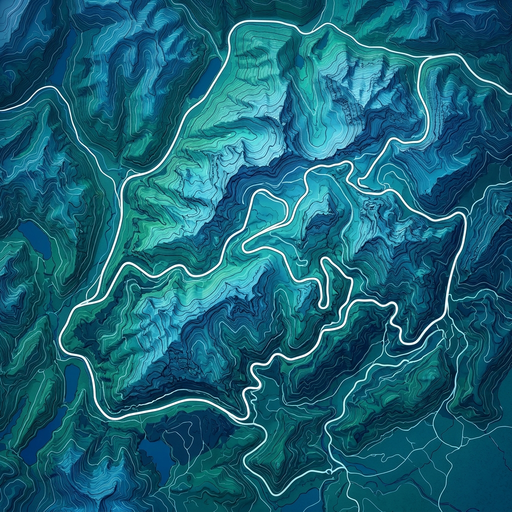

# Day 7 — Friday, Sept 18 🚗
## The Epic Transit: Val Gardena to Cortina via The Passes
**Base:** Transit (Val Gardena → Cortina)

---

## ✅ Main Activity: High Alpine Passes & WWI Tunnels

**Expectation & Rationale:** 
Today you shift your base from the Western to the Eastern Dolomites. Instead of taking the fast highway, you are driving the "Great Dolomite Road" — a stunning sequence of high-altitude mountain passes. Earth Trekkers calls this one of the most scenic drive days of the entire trip. Along the way, you'll break up the driving by riding cable cars to two epic viewpoints: the WWI tunnels of Lagazuoi, and the highest peak in the Dolomites, Marmolada.

### 1. Lagazuoi Cable Car & WWI Tunnels
* **Elevation Change**: Cable car to 2,752m.
* **Difficulty**: ⭐⭐ Moderate (downhill walk through tunnels if you choose to hike it).
* **Duration**: 2-3 hours
* **Resources**: [Earth Trekkers: Lagazuoi Tunnels](https://www.earthtrekkers.com/hiking-the-lagazuoi-tunnels-dolomites/)
* **Notes**: You can take the cable car up and back down just for the views, OR you can take it up, rent a helmet/headlamp at the top, and walk 4km downhill *inside* the mountain through the WWI tunnels excavated by Italian soldiers. 

### 2. Marmolada (The Queen of the Dolomites)
* **Elevation Change**: Cable car in 3 stages to Punta Rocca (3,265m).
* **Difficulty**: ⭐ Easy
* **Duration**: 1.5–2 hours
* **Resources**: [Earth Trekkers: Marmolada](https://www.earthtrekkers.com/marmolada-highest-mountain-in-the-dolomites/)
* **Notes**: Marmolada is the only remaining large glacier in the Dolomites. The Malga Ciapela cable car whisks you to the top. Visit the Museum of the Great War at the Serauta mid-station (included in ticket). 

---

## 📌 Logistics & Drive Breakdown

[🗺️ **Click here to open today's Driving Route in Google Maps**](https://www.google.com/maps/dir/Ortisei/Passo+Pordoi/Malga+Ciapela/Passo+Falzarego/Cortina+d'Ampezzo)

| # | From | To | Distance | Drive Time | Road | Notes |
|---|------|----|----------|------------|------|-------|
| 1 | Val Gardena (Ortisei) | Passo Pordoi | 26 km | ~45 min | SS242 | Stunning climb out of Val Gardena. |
| 2 | Passo Pordoi | Malga Ciapela (Marmolada) | 24 km | ~40 min | SR48, SP641 | Drive over Passo Fedaia and past the lake. |
| 3 | Malga Ciapela | Passo Falzarego (Lagazuoi) | 28 km | ~45 min | SP641, SP244 | Drive north toward the WWI tunnels. |
| 4 | Passo Falzarego | Cortina d'Ampezzo | 17 km | ~30 min | SR48 | Steep, winding descent into Cortina. |
| — | **Total Transit Drive** | | **~95 km** | **~2.5–3 hours** | | *Does not include time at stops.* |

### 🗺️ Visual Route Map
*(Click the map to open the live interactive Google Maps directions)*

### 🕐 Hour-by-Hour Schedule

| Time | Location | Activity | Detail |
|------|----------|----------|--------|
| 8:30 am | Val Gardena | 🚗 Depart | Car fully packed. Head east on SS242. |
| 9:15 am | Passo Pordoi | 📸 Viewpoint Stop | Optional: Ride the Sass Pordoi cable car if time permits. |
| 10:00 am | Passo Pordoi | 🚗 Drive South | Head toward Marmolada via Passo Fedaia. |
| 10:45 am | Malga Ciapela | 🅿️ Arrive & Park | Base of Marmolada cable car. |
| 11:00 am | Marmolada | 🚡 Cable Car | Ride to Punta Rocca (3,265m). Bring a jacket! |
| 11:30 am | Serauta Mid-station | 🏛️ Museum & Lunch | See the WWI museum, grab food at the restaurant. |
| 1:00 pm | Malga Ciapela | 🚗 Drive North | Head toward Lagazuoi. |
| 1:45 pm | Passo Falzarego | 🅿️ Arrive & Park | Base of the Lagazuoi cable car. |
| 2:00 pm | Lagazuoi | 🚡 Cable Car / Hike | Ride up. Walk the tunnels down (or ride back down). |
| 5:00 pm | Passo Falzarego | 🚗 Drive East | Head down into the Cortina valley. |
| 5:30 pm | Cortina d'Ampezzo | 🏠 Arrive at Hotel | Check into your new base for the rest of the trip! |

### Key Logistics Notes

* **Baggage Security**: You will have your luggage in the car all day. Park in high-visibility areas, lock doors, and try to keep bags covered in the trunk. The Dolomites are very safe, but standard transit-day precautions apply.
* **Weather Dependency**: High-altitude cable cars (Marmolada, Sass Pordoi) are pointless in heavy clouds. If visibility is zero, skip the cable cars and enjoy the driving route. 
* **Tunnel Walk**: If you decide to do the Lagazuoi tunnel walk, you **must** have a headlamp (phone flashlights are not enough) and decent hiking shoes. The tunnels are dark, steep, and wet. You can rent helmets/lamps at the cable car station.
