# 🍴 Must-Try Restaurant & Food Guide: Dolomites, Venice & Madrid

This guide is structured to help you navigate dining seamlessly throughout the 16-day trip. To eliminate guesswork, restaurants and culinary experiences are strictly separated into two distinct categories:

1. **🏔️ While "Out" (On-Trail & Mountain Excursions)**: High-altitude mountain rifugios, alpine dairy farms (*malgas* / *schwaigen*), panoramic pass lounges, and day-trip island trattorias visited mid-day during activities.
2. **🍷 Near Lodging (Base Town Evenings & Dinners)**: Traditional inns (*stuben*), Michelin-starred agriturismi, wood-fired steak houses, canal-side *bàcari*, and historic taverns located walking distance or a short drive from your lodging.

For every venue, you will find the **specific dishes you must order**, the **exact reservation requirements**, and **community research links (Reddit, Michelin, Saveur)** backing up the recommendation.

---

## 📋 Quick Reference: Master Dining Matrix

### Table 1: While "Out" (Lunches, Mountain Rifugios & Alpine Malgas)

| Day | Trail / Location | Venue & Type | Specific Foods to Try | Booking Required? |
|:---:|:---|:---|:---|:---|
| **Day 3** | Val di Funes (Adolf Munkel) | **Geisleralm** *(Alpine Rifugio)* | Tris di Canederli, Kaiserschmarrn, Schlutzkrapfen | 🚶 **Walk-in Only** (Arrive by 11:30 AM) |
| **Day 3** | Val di Funes (Adolf Munkel) | **Gschnagenhardt-Alm** *(Family Malga)* | Extra-Crispy Kaiserschmarrn, Goulash | 🚶 **Walk-in Only** |
| **Day 4** | Alpe di Siusi (Meadow) | **Malga Sanon** *(Alpine Chalet)* | Brettljause, Grilled Alpine Steaks, Dumplings | 🚶 **Walk-in Only** |
| **Day 4** | Alpe di Siusi (Meadow) | **Gostner Schwaige** *(Artisanal Farm)* | Mountain Herb Hay Soup, Flower Cheeses | 🚶 **Walk-in Only** (Small terrace) |
| **Day 4** | Alpe di Siusi (Meadow) | **Almrosenhütte** *(Pastry Hut)* | Apfelstrudel with Vanillesauce, Hugo Spritz | 🚶 **Walk-in Only** |
| **Day 5** | Seceda Summit (2,410m) | **Sofie Hütte** *(Summit Lounge)* | Apfelstrudel, Bombardino, Refined Tyrolean | 🚶 **Walk-in Only** (Terrace) |
| **Day 5** | Seceda Ridgeline | **Malga Pieralongia** *(Rustic Hut)* | Fresh Buttermilk, Kaminwurz, Kaiserschmarrn | 🚶 **Walk-in Only** |
| **Day 6** | Passo Gardena (Gran Cir) | **Jimmi Hütte** *(Mountain Chalet)* | Spinatspätzle con Panna e Speck | 🚶 **Walk-in Only** |
| **Day 7** | Passo Falzarego (2,752m) | **Rifugio Lagazuoi** *(Peak Rifugio)* | Gulasch con Polenta, Bombardino | 🚶 **Walk-in Only** |
| **Day 8** | Cinque Torri (Nuvolau Ridge)| **Rifugio Averau** *(Fine Mountain Dining)*| **Casunziei all'Ampezzana**, Game Ragù Pappardelle | 🚨 **MUST BOOK IN ADVANCE** |
| **Day 8** | Cinque Torri (Rock Base) | **Rifugio Scoiattoli** *(Panoramic Hut)* | Canederli, Sautéed Polenta & Porcini | 🚶 **Walk-in Only** (Terrace) |
| **Day 9** | Tre Cime / Lago di Misurina| **Malga Misurina & Pizzeria Edelweiss** | Fresh Alpine Ricotta, Wood-fired Pizza | 🚶 **Walk-in Only** |
| **Day 13**| Burano Island (Venice) | **Trattoria Al Gatto Nero** *(Seafood)* | Spaghetti al Nero di Seppia, Risotto di Gò | 🚨 **MUST BOOK IN ADVANCE** |

---

### Table 2: Near Lodging (Base Town Evenings, Dinners & Nightlife)

| Day(s) | Base Town / Area | Venue & Type | Specific Foods to Try | Booking Required? |
|:---:|:---|:---|:---|:---|
| **Day 1** | Mestre (Piazza Ferretto) | **Casa Fortuna / Ostaria Mariano** | Venetian Seafood Pasta, Fritto Misto | ⚠️ **Recommended** (Phone) |
| **Day 1** | Mestre (Piazza Ferretto) | **Pizzium Mestre** *(Pizzeria)* | Wood-Fired Neapolitan Pizza | 🚶 **Walk-in** (Quick turnaround) |
| **Days 2–6**| Ortisei Center (Val Gardena)| **Tubladel** *(Steak & Tyrolean)* | Catalan-Oven Steaks, Braised Venison Goulash | 🚨 **MUST BOOK IN ADVANCE** |
| **Days 2–6**| Ortisei Center (Val Gardena)| **Mauriz Keller** *(Historic Cellar)* | Schlutzkrapfen, Tris di Canederli, Wood Pizza | ⚠️ **Recommended** (Phone) |
| **Days 2–6**| Ortisei Center (Val Gardena)| **Sneton Stube** *(Ladin Tavern)* | Authentic Tutres (Tirtlan), Ladin Goulash | ⚠️ **Recommended** (Tiny space) |
| **Days 2–6**| Ortisei Center (Val Gardena)| **La Cërcia** *(Wine & Aperitivo Bar)*| Speck Alto Adige PGI Board, Lagrein Wine | 🚶 **Walk-in Only** |
| **Days 7–11**| Cortina (Ampezzo Valley) | **El Brite de Larieto** *(Agriturismo)* | Farm Butter & Cheeses, Elevated Casunziei | 🚨 **MUST BOOK IN ADVANCE** |
| **Days 7–11**| Cortina (North Valley) | **Ristorante Ospitale** *(Historic Inn)* | Massive Copper Pans of Venison Goulash | ⚠️ **Recommended** (Phone) |
| **Days 7–11**| Cortina Center | **Il Vizietto** *(Upscale Italian)* | Adriatic Seafood Crudo, Fresh Tagliolini | 🚨 **MUST BOOK IN ADVANCE** |
| **Days 7–11**| Cortina Center | **Enoteca Cortina** *(Historic Wine Bar)* | Pre-dinner Ombre, Alpine Charcuterie | 🚶 **Walk-in Only** |
| **Days 12–13**| Venice (Cannaregio Canal) | **Al Timon** *(Bàcaro & Steaks)* | Canal Boat Cicchetti, Baccalà Mantecato | 🚶 **Walk-in Only** (Cicchetti) |
| **Days 12–13**| Venice (Dorsoduro) | **Cantina Schiavi** *(Bàcaro)* | Award-Winning Crostini, Spritz al Select | 🚶 **Walk-in Only** |
| **Days 12–13**| Venice (Cannaregio) | **Paradiso Perduto** *(Lively Osteria)* | Bigoli in Salsa, Seafood Platters | ⚠️ **Recommended** (Dinner) |
| **Days 14–16**| Madrid (Plaza Mayor) | **La Campana** *(Historic Bar)* | Bocadillo de Calamares (Squid Baguette) | 🚶 **Walk-in Only** (Counter) |
| **Day 14** | Madrid (La Latina) | **Sobrino de Botín (est. 1725)** | **Cochinillo Asado** (Roast Suckling Pig) | 🚨 **MUST BOOK IN ADVANCE** |
| **Days 14–16**| Madrid (Malasaña) | **Pez Tortilla** *(Craft Beer Bar)* | Melosa Runny Tortilla de Patatas | 🚶 **Walk-in Only** (7:30 PM) |
| **Days 14–16**| Madrid (Centro) | **Chocolatería San Ginés (1894)** | Churros y Porras con Chocolate Caliente | 🚶 **Walk-in Only** (24 Hours) |

---

## 🏔️ PART 1: While "Out" — Mountain Rifugios, Alpine Pastures & Excursions

These dining spots are built into your daytime hiking and sightseeing routes. They cannot be reached by walking from town; they are high on the peaks, along the trail, or on the Venetian islands.

---

### Val di Funes (Day 3 — Adolf Munkel Trail)

#### 1. Geisleralm (Rifugio delle Odle)
* **Venue Type**: Celebrated Alpine Mountain Hut & Sun Terrace
* **Location**: Midpoint of the Adolf Munkel trail, directly below the jagged Odle / Geisler spires.
* **Reservations**: 🚶 **Walk-in Only**. Arrive by 11:30 AM to secure prime outdoor tables.
* **Specific Foods to Order**:
  * **Tris di Canederli**: Three baseball-sized bread dumplings (Speck Alto Adige, mountain spinach, and molten alpine cheese) drenched in browned alpine butter and chives.
  * **Kaiserschmarrn**: Fluffy, rum-kissed shredded pancake caramelized in cast iron, served with tart lingonberry jam (*Preiselbeeren*) and warm applesauce.
* **The Experience**: Home to the famous "Geisler Cinema"—wooden deck chairs set on the pasture facing the vertical needle peaks.

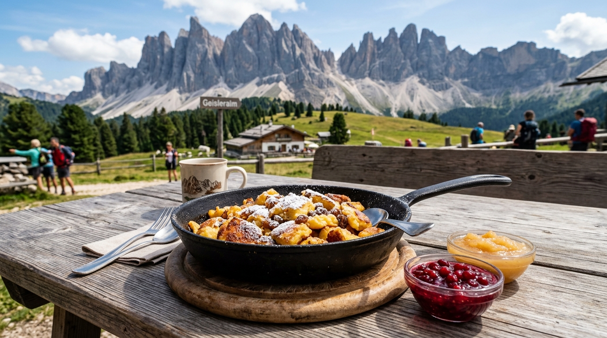

* **Research & Hype Links**:
  * [r/Dolomites: "Geisleralm Tris di Knödel with views of the Odle peaks — highlight of our trip"](https://www.reddit.com/r/Dolomites/)
  * [r/travel: "Kaiserschmarrn at Geisleralm is the single greatest dessert in the Alps"](https://www.reddit.com/r/travel/)
  * [Official Portal: Geisleralm Gastronomy](https://www.geisleralm.com/en/)

---

#### 2. Gschnagenhardt-Alm
* **Venue Type**: Traditional Family-Run Alpine Malga
* **Location**: 5-minute walk past Geisleralm on the Adolf Munkel loop.
* **Reservations**: 🚶 **Walk-in Only**.
* **Specific Foods to Order**:
  * **Extra-Crispy Kaiserschmarrn**: Cooked in antique skillets for an extra-caramelized, crunchy outer crust.
  * **Tyrolean Beef Goulash**: Hearty, peppery beef stew served with farm bread or polenta.
* **Why Choose It**: If Geisleralm's terrace is at maximum capacity, Gschnagenhardt offers an equally breathtaking, quieter, ultra-authentic alpine family experience.

---

### Alpe di Siusi (Day 4 — E-Bike Meadow Day)

#### 3. Malga Sanon (Sanon Hütte)
* **Venue Type**: High-Altitude Pasture Chalet & Grill
* **Location**: Rolling meadows of Alpe di Siusi, with unobstructed views of the Sassolungo and Sassopiatto massifs.
* **Reservations**: 🚶 **Walk-in Only**.
* **Specific Foods to Order**:
  * **Tyrolean Brettljause**: A massive rustic plank of paper-thin Speck Alto Adige PGI, aged mountain cheeses, grated horseradish, and crunchy *Schüttelbrot*.
  * **Grilled Alpine Steaks**: Local beef and game grilled over open coals.

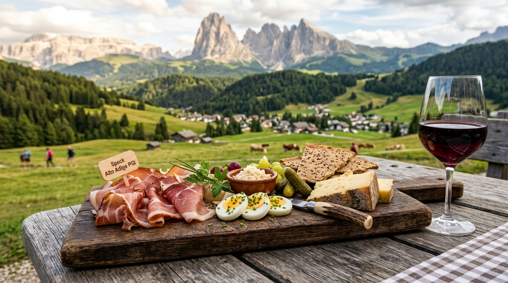

* **Research & Hype Links**:
  * [r/Dolomites: "Sitting on Alpe di Siusi with a Brettljause and local wine is pure heaven"](https://www.reddit.com/r/Dolomites/)
  * [Speck Alto Adige PGI Consortium](https://www.speck.it/en/)

---

#### 4. Gostner Schwaige
* **Venue Type**: Artisanal Alpine Dairy & Farm Kitchen
* **Location**: Eastern pastures of Alpe di Siusi (near Saltria).
* **Reservations**: 🚶 **Walk-in Only** (Tiny terrace; aim for a morning snack or early lunch).
* **Specific Foods to Order**:
  * **Heusuppe (Alpine Hay Soup)**: Served inside a hollowed-out loaf of crusty farm bread, infused with 15 meadow herbs.
  * **Flower-Pressed Artisan Cheeses**: Farmhouse curd and raw milk cheeses made on-site by chef Franz Mulser, pressed with edible alpine blossoms.
* **Research & Hype**: Featured in international culinary magazines for elevating rustic farm food to haute cuisine.

---

#### 5. Almrosenhütte
* **Venue Type**: Sun Terrace & Mountain Pastry Hut
* **Location**: Southern crest of Alpe di Siusi.
* **Reservations**: 🚶 **Walk-in Only**.
* **Specific Foods to Order**:
  * **Apfelstrudel Alto Adige**: Flaky pastry stuffed with spiced orchard apples, toasted pine nuts, and raisins, swimming in warm vanilla cream.
  * **Hugo Spritz**: Prosecco, local elderflower syrup, sparkling water, and fresh garden mint.

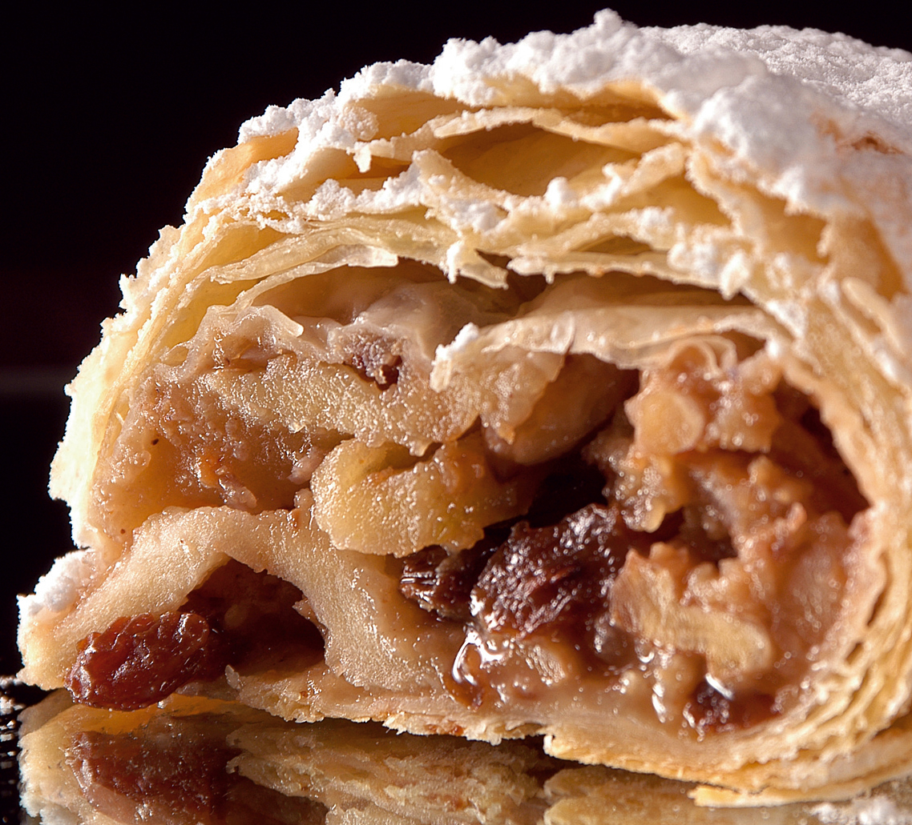

---

### Seceda Summit & Ridge (Day 5 — Ridgeline Hike)

#### 6. Sofie Hütte (2,410m)
* **Venue Type**: High-Altitude Panoramic Lounge & Wine Sanctuary
* **Location**: Directly below the Seceda cable car summit station.
* **Reservations**: 🚶 **Walk-in Only for terrace lunch**; indoor restaurant tables bookable.
* **Specific Foods to Order**:
  * **Il Bombardino**: Steaming egg liqueur, brandy, espresso, and a mountain of whipped cream with cocoa.
  * **Elevated Schlutzkrapfen**: Delicate spinach-ricotta rye mezzelune in hazelnut brown butter.
  * **South Tyrolean Pinot Noir & Lagrein**: From an extraordinary cellar holding over 300 regional labels.

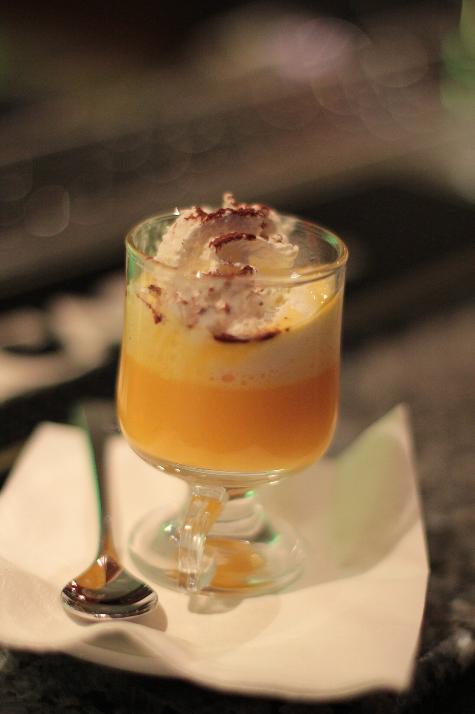

* **Research & Hype Links**:
  * [r/skiing: "The Italian Bombardino is objectively the greatest mountain beverage on earth"](https://www.reddit.com/r/skiing/)
  * [Punch Drink: How the Bombardino Conquered the Italian Alps](https://punchdrink.com/articles/bombardino-cocktail-recipe-italian-alps/)

---

#### 7. Malga Pieralongia
* **Venue Type**: Historic Alpine Stone Barn & Snack Hut
* **Location**: Along Trail 2B between Seceda and the Pieralongia twin needle rocks.
* **Reservations**: 🚶 **Walk-in Only**. Cash only!
* **Specific Foods to Order**:
  * **Fresh Buttermilk (*Buttermilch*)**: Freshly churned daily from cows grazing the ridge.
  * **Kaminwurz & Schüttelbrot**: Smoked cured pork sausages snapped with crunchy caraway bread.
* **The Experience**: Friendly donkeys freely wander the picnic benches while you rest below the spires.

---

### Passo Gardena / Gran Cir (Day 6 — West Split Day)

#### 8. Jimmi Hütte & Dantercepies Mountain Lounge
* **Venue Type**: Alpine Chalets at Passo Gardena (2,220m)
* **Location**: Top of Dantercepies gondola / base of the Gran Cir scramble.
* **Reservations**: 🚶 **Walk-in Only**.
* **Specific Foods to Order**:
  * **Spinatspätzle con Panna e Speck**: Vibrant green spinach drop-dumplings drenched in heavy cream and crisped Speck Alto Adige batons.
  * **South Tyrolean Goulash Suppe**: Spicy paprika broth packed with tender beef.

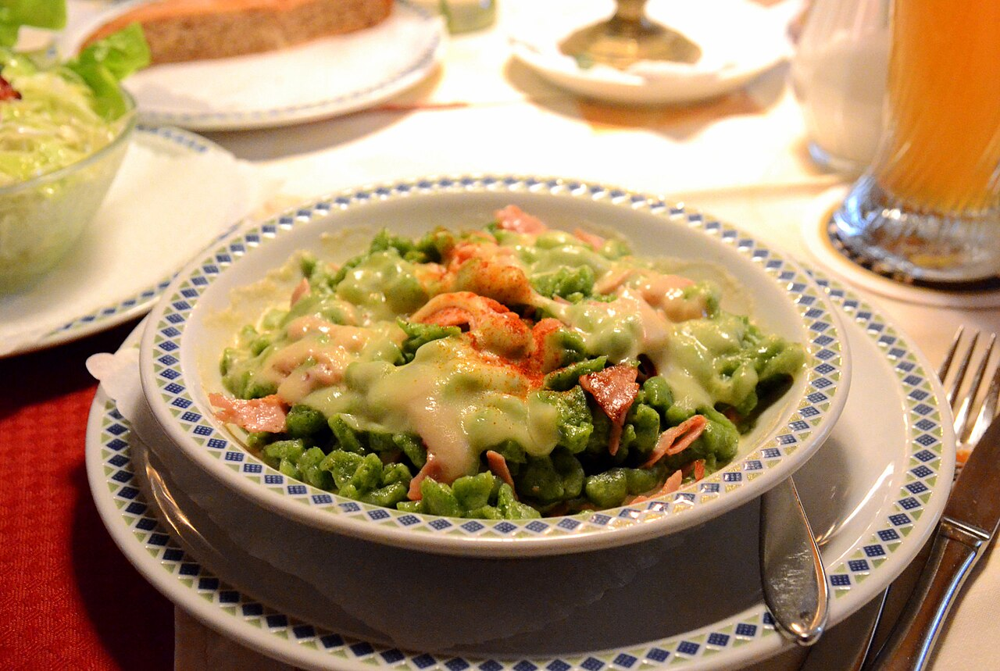

* **Research & Hype Links**:
  * [r/Dolomites: "Spinach Spätzle at Jimmi Hütte after doing Gran Cir hit every single spot"](https://www.reddit.com/r/Dolomites/)

---

### Great Dolomite Road (Day 7 — Transit Day)

#### 9. Rifugio Lagazuoi (2,752m)
* **Venue Type**: Eagle's Nest Mountain Rifugio
* **Location**: Clifftop summit of Mount Lagazuoi above Passo Falzarego (reached via cable car).
* **Reservations**: 🚶 **Walk-in Only** for self-service terrace and bar.
* **Specific Foods to Order**:
  * **Gulasch Altoatesino con Polenta**: Deep, rich beef stew served over steaming stone-ground polenta.
  * **Mid-Day Bombardino or Espresso**: Consumed 2,752 meters in the sky with clouds drifting below the deck.

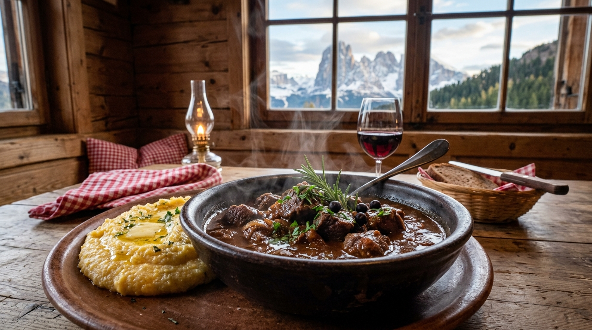

---

### Cinque Torri & Nuvolau (Day 8 — Tower Loop & Ridge Hike)

#### 10. Rifugio Averau (2,413m)
* **Venue Type**: Globally Renowned Mountain Gourmet Kitchen
* **Location**: Forcella Nuvolau, between Cinque Torri and Mount Nuvolau.
* **Reservations**: 🚨 **MANDATORY ADVANCE BOOKING REQUIRED**.
  * *How to Book*: Email `rifugioaverau@gmail.com` or call `+39 0436 4660` 2–3 weeks ahead. Book lunch for 5 adults at ~12:30 PM.
* **Specific Foods to Order**:
  * **Casunziei all'Ampezzana**: Ampezzo's legendary crescent ravioli packed with sweet magenta beetroot and ricotta, finished with foaming butter and poppy seeds.
  * **Pappardelle al Capriolo**: Thick hand-cut egg pasta with slow-braised venison ragù and blueberries.

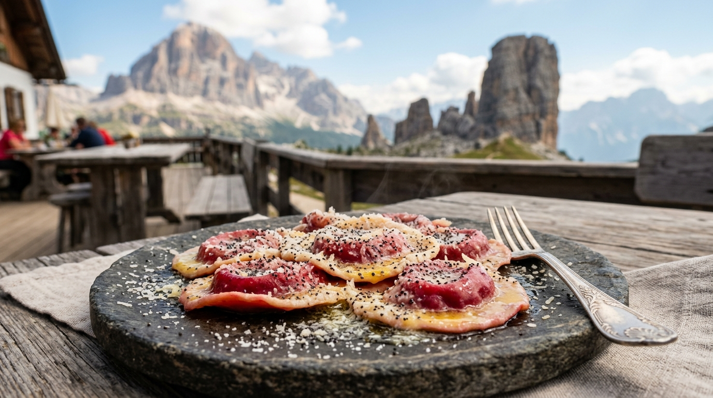

* **Research & Hype Links**:
  * [r/ItalyTravel: "Rifugio Averau pasta is seriously on another level compared to standard hut food"](https://www.reddit.com/r/ItalyTravel/)
  * [r/Dolomites: "Book Rifugio Averau for lunch on your Cinque Torri day — the Casunziei are legendary"](https://www.reddit.com/r/Dolomites/)
  * [Cortina Dolomiti Tourism: Casunziei all'Ampezzana Heritage](https://www.dolomiti.org/en/cortina/food/casunziei-ampezzana)
  * [Earth Trekkers: Why Averau's Food is a Must-Do](https://www.earthtrekkers.com/rifugio-averau-rifugio-nuvolau-hike-dolomites/)

---

#### 11. Rifugio Scoiattoli (2,255m)
* **Venue Type**: Iconic Panoramic Chalet
* **Location**: Directly at the top of the 5 Torri chairlift, gazing straight into the rock face.
* **Reservations**: 🚶 **Walk-in Only** (Terrace tables turn over quickly).
* **Specific Foods to Order**:
  * **Polenta e Funghi Porcini con Formaggio Fuso**: Creamy polenta blanketed in pan-fried wild porcini and melted alpine cheese.

---

### Tre Cime di Lavaredo (Day 9 — Three Peaks Day)

#### 12. Lago di Misurina Lakeside Huts
* **Venue Type**: Lakeside Chalets & Pizzerias
* **Location**: Shore of Lago di Misurina (1,756m), 15 min drive down from Rifugio Auronzo.
* **Reservations**: 🚶 **Walk-in Only**.
* **Specific Foods to Order**:
  * **Fresh Alpine Ricotta & Cheeses** at *Malga Misurina*.
  * **Crisp Thin-Crust Pizza** at *Pizzeria Edelweiss* overlooking the calm lake waters.

---

### Venetian Lagoon Excursion (Day 13 — Burano Island)

#### 13. Trattoria Al Gatto Nero (Burano)
* **Venue Type**: World-Famous Lagoon Seafood Trattoria
* **Location**: Island of Burano (45 min vaporetto boat ride from Venice center).
* **Reservations**: 🚨 **MANDATORY ADVANCE BOOKING REQUIRED**.
  * *How to Book*: Reserve 3–4 weeks in advance via their website or phone (`+39 041 730120`).
* **Specific Foods to Order**:
  * **Spaghetti al Nero di Seppia**: Handmade pasta coated in glossy, savory Adriatic cuttlefish ink.
  * **Risotto di Gò**: Creamy carnaroli risotto cooked in a broth of lagoon rock goby fish—Anthony Bourdain's all-time favorite Venetian dish.

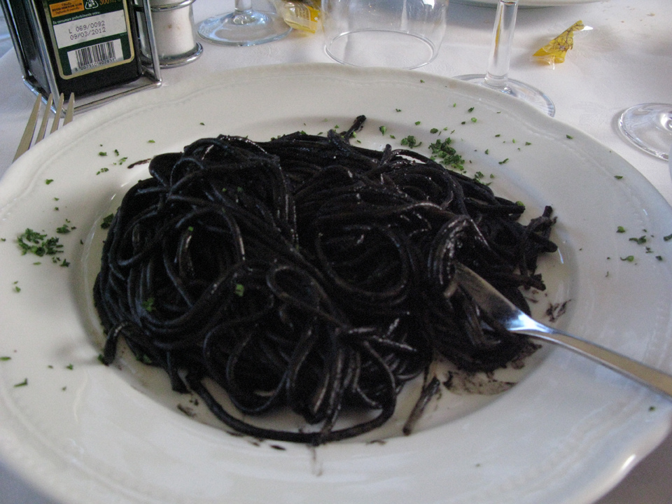

* **Research & Hype Links**:
  * [r/ItalyTravel: "Al Gatto Nero in Burano lives up to every bit of the hype — squid ink pasta and risotto di gò"](https://www.reddit.com/r/ItalyTravel/)
  * [Saveur: The Seafood Traditions of Burano and Al Gatto Nero](https://www.saveur.com/)

---

## 🍷 PART 2: Near Lodging — Evening Dinners & Base City Taverns

These restaurants are located right in your base towns. You can walk to them from your apartment or hotel, or take a short 5-minute taxi/drive after showering off the trail.

---

### Base 1: Venice-Mestre (Day 1 — Arrival Evening)
*Lodging: Via della Brenta Vecchia, 34 (Near Piazza Erminio Ferretto)*

#### 14. Ristorante Casa Fortuna & Ostaria da Mariano
* **Venue Type**: Authentic Local Venetian Seafood Trattorias
* **Location**: 5–15 min walk from your Mestre apartment.
* **Reservations**: ⚠️ **Recommended for dinner** (Call `+39 041 972620` for Casa Fortuna).
* **Specific Foods to Order**:
  * **Peoci Saltai**: Black mussels sautéed with garlic, black pepper, and white wine.
  * **Fritto Misto dell'Adriatico**: Lightly dusted fried squid, calamari, and lagoon sardines.

---

#### 15. Pizzium Mestre
* **Venue Type**: High-Energy Neapolitan Pizzeria
* **Location**: Directly on Piazza Ferretto (5 min walk from apartment).
* **Reservations**: 🚶 **Walk-in Friendly** (Fast seating).
* **Specific Foods to Order**:
  * **Wood-Fired Pizza Margherita with Bufala DOP**: Perfect comforting, zero-stress dinner after your trans-Atlantic flight.

---

### Base 2: Ortisei / Val Gardena (Days 2–6)
*Lodging: Apartments Promenade, SASLONCH (Via Stufan 72 — 5–10 min walk to center)*

#### 16. Restaurant Tubladel
* **Venue Type**: Renowned Rustic-Chic Alpine Grill & Stube
* **Location**: Str. Trebinger, 22, Ortisei (8 min walk from apartment).
* **Reservations**: 🚨 **MANDATORY ADVANCE BOOKING REQUIRED**.
  * *How to Book*: Book 2–3 weeks in advance online at [tubladel.com](https://www.tubladel.com) or call `+39 0471 796879`.
* **Specific Foods to Order**:
  * **Dry-Aged Tomahawk & Local Beef**: Prepared in their patented wood-burning Catalan oven.
  * **Slow-Braised Venison / Deer Ossobuco**: Ultra-tender wild game with herb polenta.

---

#### 17. Mauriz Keller
* **Venue Type**: Atmospheric Historic Beer & Wine Cellar
* **Location**: Piazza San Antonio, Ortisei center (6 min walk from apartment).
* **Reservations**: ⚠️ **Recommended for dinner** (Call `+39 0471 796415`).
* **Specific Foods to Order**:
  * **Schlutzkrapfen Fatti in Casa**: Hand-crimped spinach and ricotta mezzelune with nutty brown butter and Trentingrana.
  * **Stinco di Maiale al Forno**: Whole roasted crispy Bavarian-style pork knuckle with sauerkraut.

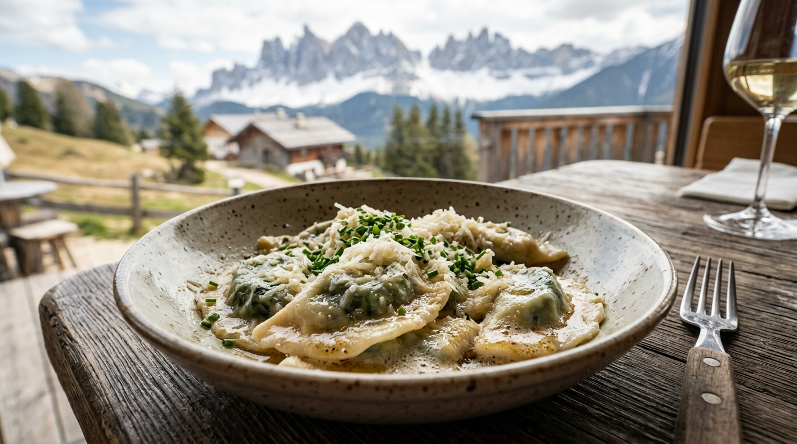

---

#### 18. Sneton Stube
* **Venue Type**: Intimate Ancestral Ladin Tavern (*Stube*)
* **Location**: Str. Sneton, Ortisei center (7 min walk from apartment).
* **Reservations**: ⚠️ **Recommended Booking** (Tiny wood-paneled room; call `+39 0471 796798`).
* **Specific Foods to Order**:
  * **Ladin Tutres (Tirtlan)**: Deep-fried golden rye pockets stuffed with sauerkraut or spinach and curd.
  * **Traditional Ladin Barley Soup (*Panicia*)**: Rich, smoky soup simmered with pork shank and vegetables.

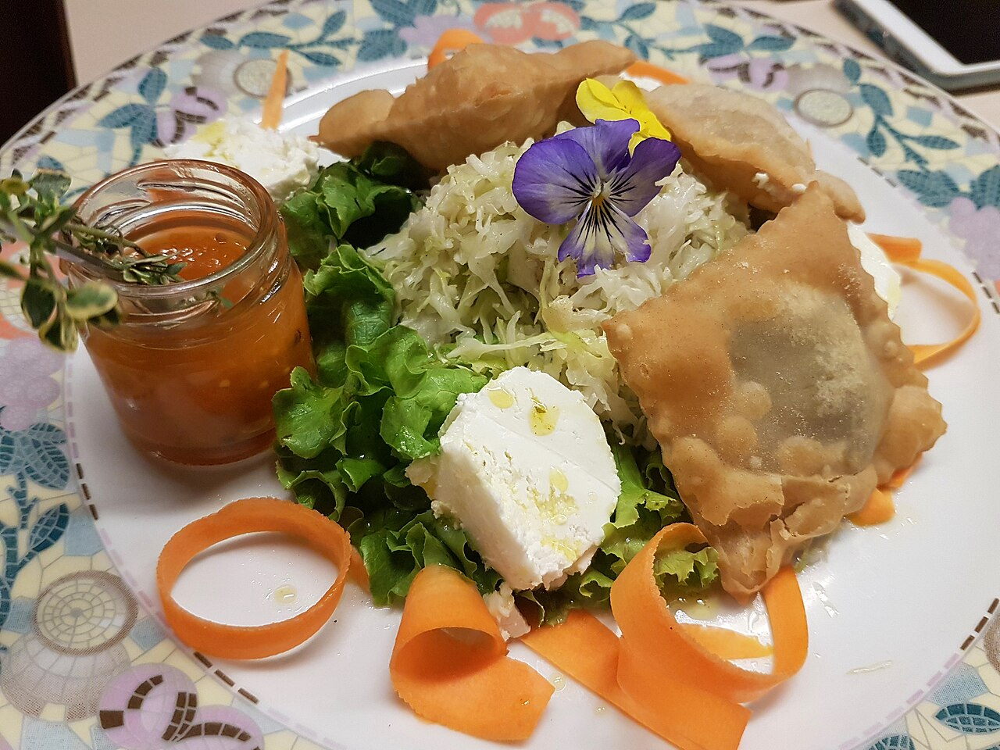

---

#### 19. La Cërcia
* **Venue Type**: Rustic Wine & Aperitivo Bar
* **Location**: Str. Rezia (pedestrian high street, 6 min walk from apartment).
* **Reservations**: 🚶 **Walk-in Only**.
* **Specific Foods to Order**:
  * **Tagliere Misto di Salumi e Formaggi**: Premium Speck Alto Adige PGI, cured bresaola, and alpine cheeses paired with local Lagrein red wine or Forst craft beer.

---

### Base 3: Cortina d'Ampezzo (Days 7–11)
*Lodging: Cortina Town Center / Immediate Valley*

#### 20. El Brite de Larieto
* **Venue Type**: Michelin Green Star Agriturismo & Mountain Farm
* **Location**: Larieto pine forest (7 min drive east of Cortina center).
* **Reservations**: 🚨 **MANDATORY ADVANCE BOOKING REQUIRED**.
  * *How to Book*: Book 3–4 weeks ahead online at [elbritedelarieto.it](https://www.elbritedelarieto.it).
* **Specific Foods to Order**:
  * **Farmstead Butter & Sourdough**: Churned that morning from the cows right outside the window.
  * **Elevated Casunziei with Mountain Herbs**: Refined beetroot ravioli made with ancient grain flours.
  * **Charcuterie Cured in Mountain Larch Wood**: In-house charcuterie from their own livestock.

---

#### 21. Ristorante Ospitale
* **Venue Type**: Historic 11th-Century Coaching Inn
* **Location**: Località Ospitale (10 min drive north of Cortina on SS51).
* **Reservations**: ⚠️ **Recommended for dinner** (Call `+39 0436 4585`).
* **Specific Foods to Order**:
  * **Copper Pan Venison Goulash**: Giant copper skillets of fork-tender venison goulash ladled tableside with steaming polenta.
  * **Canederli Pressati (*Pressknödel*)**: Pan-fried alpine cheese dumplings served over warm cabbage salad with hot bacon fat.

---

#### 22. Il Vizietto di Cortina
* **Venue Type**: Contemporary Refined Italian
* **Location**: Corso Italia pedestrian zone, Cortina center.
* **Reservations**: 🚨 **MANDATORY ADVANCE BOOKING REQUIRED**.
  * *How to Book*: Book 2 weeks ahead online or call `+39 0436 863804`.
* **Specific Foods to Order**:
  * **Fresh Adriatic Tagliolini**: Hand-cut pasta with sweet red shrimp and zucchini blossoms.
  * **Pistachio-Crusted Lamb Chops**: A refined break from heavy alpine stews.

---

#### 23. Enoteca Cortina
* **Venue Type**: Historic Wine Bar (Serving since 1965)
* **Location**: Via del Mercato, Cortina center.
* **Reservations**: 🚶 **Walk-in Only**.
* **Specific Foods to Order**:
  * **Glass of Amarone or Franciacorta** paired with small bites of venison salami and pickled wild mountain mushrooms before dinner.

---

### Base 4: Venice Island (Days 12–13)
*Lodging: Cà Landillo, Cannaregio (Rio Terà Farsetti, 1844)*

#### 24. Al Timon & Cantina Schiavi
* **Venue Type**: Iconic Venetian *Bàcari* (Canal Wine Bars)
* **Location**: 
  * *Al Timon*: Fondamenta dei Ormesini, Cannaregio (3 min walk from Cà Landillo!)
  * *Cantina Schiavi*: Fondamenta Nani, Dorsoduro.
* **Reservations**: 🚶 **Walk-in Only**.
* **Specific Foods to Order**:
  * **Baccalà Mantecato Crostini**: Whipped Norwegian stockfish mousse on crusty bread or grilled white polenta.
  * **Sarde in Saor**: Sweet-and-sour fried sardines with onions, raisins, and pine nuts.
  * **Spritz al Select**: The authentic Venetian spritz (Select bitters, not Aperol).

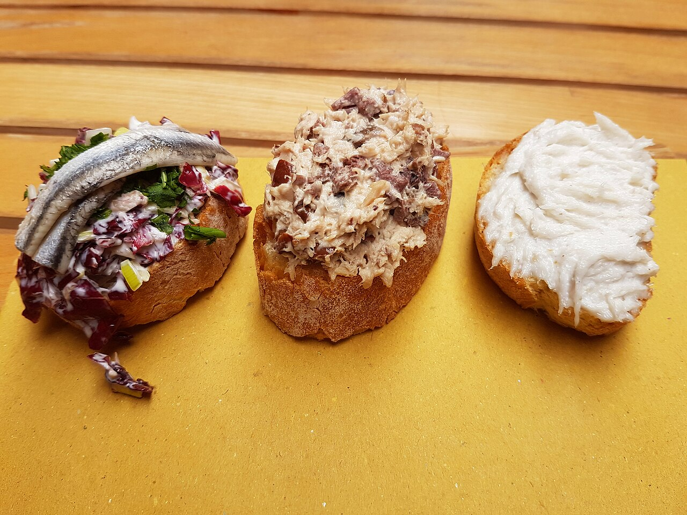

* **Research & Hype Links**:
  * [r/ItalyTravel: "The best evening in Venice: cicchetti crawl along the Cannaregio canals"](https://www.reddit.com/r/ItalyTravel/)
  * [r/travel: "Baccalà mantecato at Al Timon changed my perception of Venetian food"](https://www.reddit.com/r/travel/)

---

#### 25. Paradiso Perduto
* **Venue Type**: Boisterous Canal-Side Osteria & Live Music
* **Location**: Fondamenta della Misericordia, Cannaregio (4 min walk from Cà Landillo).
* **Reservations**: ⚠️ **Recommended for dinner** (Call `+39 041 720581`).
* **Specific Foods to Order**:
  * **Gran Piatto di Frutti di Mare**: Enormous seafood platter with razor clams, langoustines, and octopus.
  * **Bigoli in Salsa**: Ancient Venetian whole-wheat pasta tossed in slow-melted anchovies and onions.

---

### Base 5: Madrid (Days 14–16)
*Lodging: Central Madrid (Malasaña / Chueca / Centro)*

#### 26. Sobrino de Botín (est. 1725)
* **Venue Type**: World's Oldest Continuously Operating Restaurant (Guinness World Records)
* **Location**: Calle de Cuchilleros, 17 (Near Plaza Mayor).
* **Reservations**: 🚨 **MANDATORY ADVANCE BOOKING REQUIRED**.
  * *How to Book*: Book 3–4 weeks ahead online at [botin.es](https://botin.es). Request a table in *la bodega* (16th-century brick cellar).
* **Specific Foods to Order**:
  * **Cochinillo Asado**: Whole suckling pig roasted in a 300-year-old oak wood oven. Glass-crisp blistered crackling skin over butter-soft pork, carved before you with the edge of a ceramic plate!

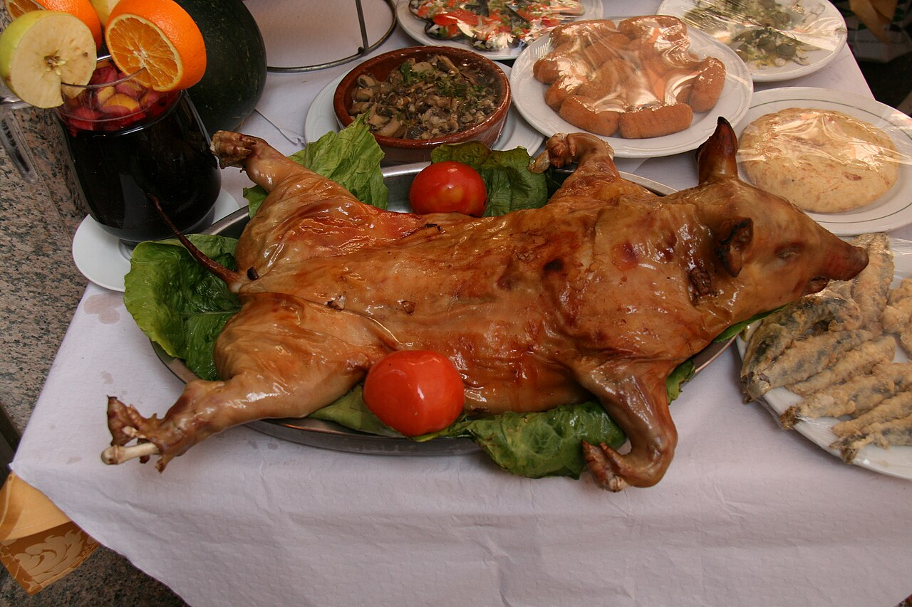

* **Research & Hype Links**:
  * [Guinness World Records: Oldest Restaurant in the World (Botín, 1725)](https://www.guinnessworldrecords.com/world-records/oldest-restaurant)
  * [r/travel: "Dinner at Sobrino de Botín in Madrid: the suckling pig lives up to 300 years of reputation"](https://www.reddit.com/r/travel/)

---

#### 27. La Campana (Plaza Mayor)
* **Venue Type**: Historic Street Food Sandwich Bar
* **Location**: Calle de Botoneras, 6 (Right off Plaza Mayor).
* **Reservations**: 🚶 **Walk-in Only** (Counter service).
* **Specific Foods to Order**:
  * **Bocadillo de Calamares**: Crusty Spanish baguette packed with steaming, crispy golden squid rings and fresh lemon (~€4).

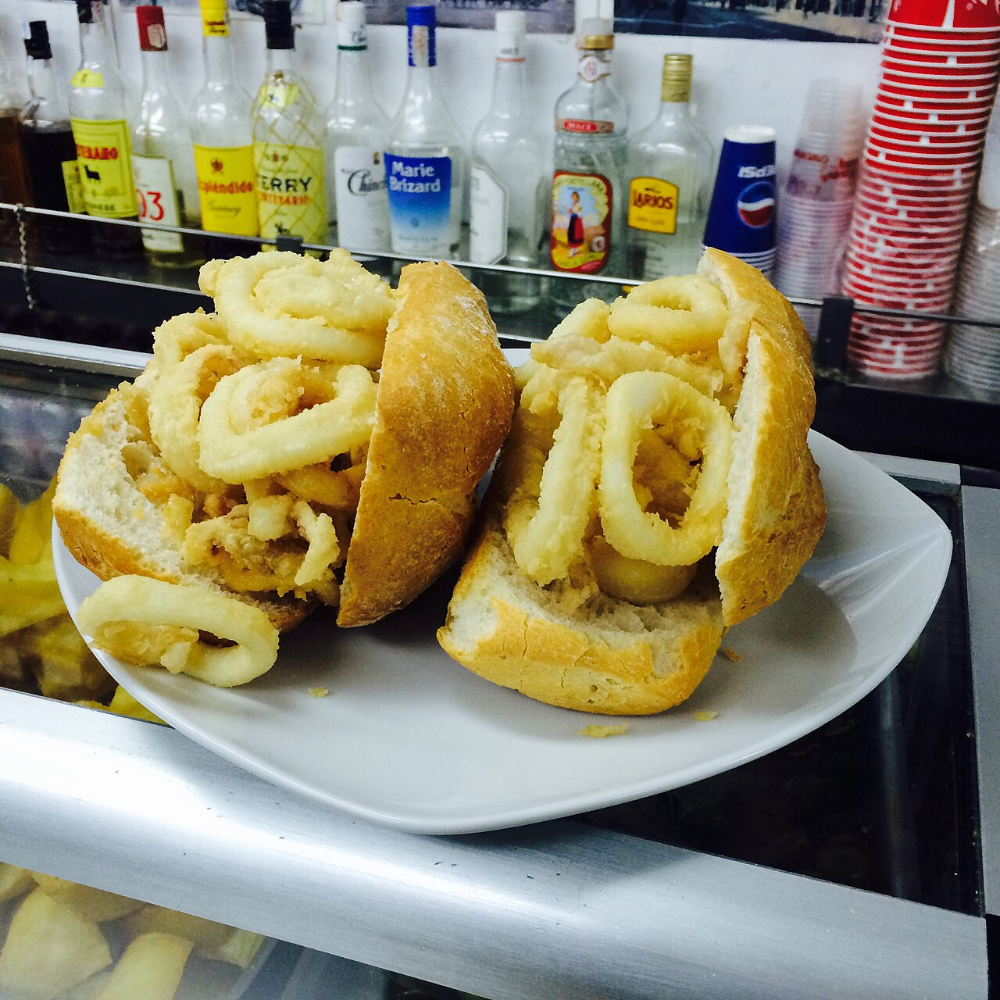

* **Research & Hype Links**:
  * [r/Madrid: "La Campana bocadillo de calamares is the best €4 you will ever spend in Madrid"](https://www.reddit.com/r/Madrid/)

---

#### 28. Pez Tortilla & Chocolatería San Ginés
* **Venue Type**: Modern Craft Beer Tapas Bar & 1894 Churrería
* **Location**: 
  * *Pez Tortilla*: Calle del Pez, 36, Malasaña (Heart of nightlife).
  * *Chocolatería San Ginés*: Pasadizo de San Ginés, 5 (Open 24 hours).
* **Reservations**: 🚶 **Walk-in Only**.
* **Specific Foods to Order**:
  * **Tortilla de Patatas Estilo Melosa** (at Pez Tortilla): Thick, molten, runny-center potato omelette stuffed with caramelized onions or truffle & brie.
  * **Churros y Porras con Chocolate** (at San Ginés): Midnight crispy fried dough dipped into thick bittersweet dark drinking chocolate after the ANYMA concert.

| Melosa Runny Tortilla | San Ginés Churros con Chocolate |
|:---:|:---:|
| 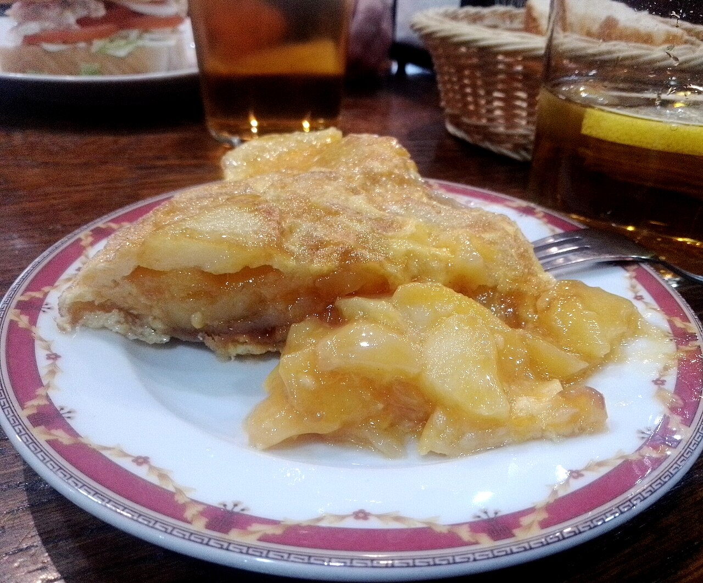 | 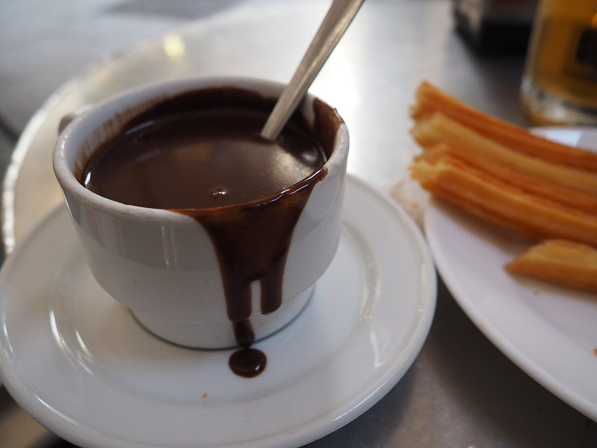 |

* **Research & Hype Links**:
  * [r/Madrid: "Pez Tortilla in Malasaña is hands down the best runny tortilla and craft beer combo in the city"](https://www.reddit.com/r/Madrid/)
  * [r/travel: "Chocolatería San Ginés churros con chocolate at 1 AM after a night out is unbeatable"](https://www.reddit.com/r/travel/)

---

## 📅 Actionable Reservation Timeline (Group of 5 Adults)

Mark these exact dates on your calendar to ensure our group doesn't miss out:

### 3 to 4 Weeks Before Departure (Mid-August 2026):
- [ ] **Rifugio Averau (Day 8 Lunch)**: Email `rifugioaverau@gmail.com` to book an outdoor table for 5 adults at 12:30 PM for Casunziei all'Ampezzana.
- [ ] **Sobrino de Botín (Day 14 Dinner)**: Book online at [botin.es](https://botin.es) for 5 adults in *la bodega* for wood-fired Cochinillo Asado.
- [ ] **El Brite de Larieto (Day 8 or 11 Dinner)**: Book online at [elbritedelarieto.it](https://www.elbritedelarieto.it) for Michelin Green Star farm dining in Cortina.
- [ ] **Trattoria Al Gatto Nero (Day 13 Lunch)**: Book online or call `+39 041 730120` if visiting Burano Island for squid-ink pasta.

### 2 Weeks Before Departure (Late-August 2026):
- [ ] **Tubladel (Day 2 or Day 6 Dinner)**: Book online at [tubladel.com](https://www.tubladel.com) for wood-oven steaks and game in Ortisei.
- [ ] **Il Vizietto (Day 7 or 10 Dinner)**: Book online or call `+39 0436 863804` for upscale dining in Cortina center.

### Days You Can Freely Walk In:
* **All Trailside Rifugios (Geisleralm, Malga Sanon, Sofie Hütte, Jimmi Hütte, Lagazuoi, Scoiattoli)**: High-capacity terraces, no reservations needed. Just arrive before peak lunch rush (11:30 AM–12:15 PM).
* **Venice Bàcari (Al Timon, Cantina Schiavi)**: Counter ordering, mingling along the canals.
* **Madrid Street Food (La Campana, Pez Tortilla, San Ginés)**: Counter ordering and casual seating.
