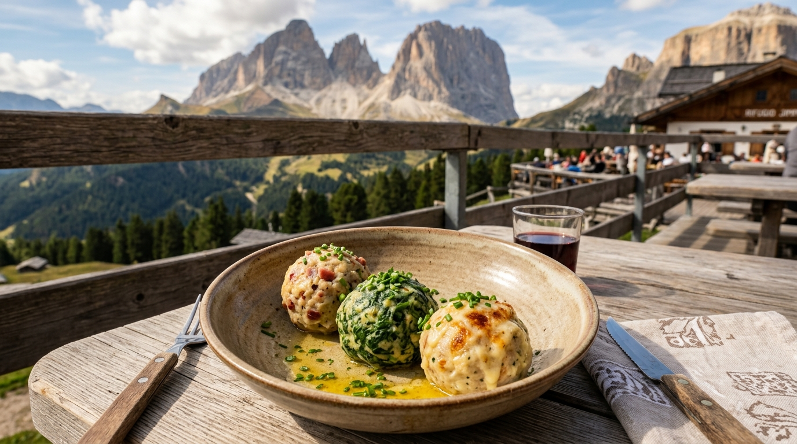

#  Must-Try Foods of the Dolomites, Venice & Madrid

The Dolomites region is one of the most culturally and culinarily fascinating crossroads in Europe. Here, three distinct cultures intersect: **Italian** culinary passion and fresh pasta craftsmanship, **Austrian / Tyrolean** alpine hearth cooking, and ancestral **Ladin** mountain foraging traditions.

Combined with our transit bases in **Venetian Lagoon bacari** and **Madrid's historic tapas taverns**, this trip is an unforgettable culinary journey. 

Below is the definitive food guide: what makes each dish unique, where to eat it along our exact daily route, which day is best, which spots **require advance reservations**, and community research from Reddit and regional culinary authorities backing up the hype.

---

##  Quick Reference & Itinerary Matching Matrix

| # | Dish | Cuisine / Origin | Best Itinerary Day | Recommended Venue | Booking Required? |
|---|------|------------------|-------------------|-------------------|-------------------|
| 1 | **[Schlutzkrapfen](#1-schlutzkrapfen-mezzelune-tirolesi)** | South Tyrol (Alpine) | **Day 2** (Ortisei) or **Day 3** (Funes) | Mauriz Keller / Geisleralm | ⚠️ Recommended for dinner / 🚶 Walk-in (Hut) |
| 2 | **[Canederli (Tris di Knödel)](#2-canederli-knodel-tris-di-canederli)** | South Tyrol / Ladin | **Day 3** (Funes) or **Day 4** (Alpe di Siusi) | Geisleralm / Malga Sanon | 🚶 Walk-in Only |
| 3 | **[Casunziei all'Ampezzana](#3-casunziei-allampezzana)** | Cortina d'Ampezzo | **Day 8** (Cinque Torri) | Rifugio Averau | 🚨 **MUST BOOK IN ADVANCE** |
| 4 | **[Kaiserschmarrn](#4-kaiserschmarrn-the-emperors-shredded-pancake)** | South Tyrol / Austrian | **Day 3** (Val di Funes) | Geisleralm ("Geisler Cinema") | 🚶 Walk-in Only |
| 5 | **[Speck Alto Adige & Brettljause](#5-speck-alto-adige-pgi-brettljause-merende)** | South Tyrol | **Day 4** (Alpe di Siusi) or **Day 2/5** | Gostner Schwaige / La Cërcia | 🚶 Walk-in Only |
| 6 | **[Gulasch Altoatesino con Polenta](#6-gulasch-altoatesino-con-polenta)** | South Tyrol / Ampezzo | **Day 7** (Lagazuoi) or **Day 10** (Cortina) | Ristorante Ospitale / Tubladel | ⚠️ Recommended (Ospitale) / 🚨 Must Book (Tubladel) |
| 7 | **[Apfelstrudel Alto Adige](#7-apfelstrudel-alto-adige-south-tyrolean-apple-strudel)** | South Tyrol | **Day 4** (Alpe di Siusi) or **Day 5** (Seceda) | Almrosenhütte / Sofie Hütte | 🚶 Walk-in Only |
| 8 | **[Spätzle Tirolesi con Panna e Speck](#8-spatzle-tirolesi-con-panna-e-speck)** | South Tyrol / Gardena | **Day 6** (Gran Cir / Passo Gardena) | Jimmi Hütte / Dantercepies | 🚶 Walk-in Only |
| 9 | **[Tirtlan (Tutres) & Strauben](#9-tirtlan-tutres-strauben-ladin-pastries)** | Ladin Valleys | **Day 6** (Ortisei) or **Day 3** (Funes) | Sneton Stube / Geisleralm | ⚠️ Recommended (Sneton Stube) |
| 10 | **[Bombardino & Hugo Spritz](#10-the-bombardino-the-hugo-spritz-alpine-elixirs)** | Italian Alps / Alto Adige | **Day 5** (Seceda) or **Day 7** (Lagazuoi) | Sofie Hütte / Rifugio Lagazuoi | 🚶 Walk-in Only |
| 11 | **[Venetian Cicchetti & Baccalà](#11-venetian-cicchetti-baccala-mantecato)** | Venetian Lagoon | **Day 12** (Venice Canal Crawl) | Al Timon / Cantina Schiavi | 🚶 Walk-in Only |
| 12 | **[Spaghetti al Nero di Seppia](#12-spaghetti-al-nero-di-seppia-squid-ink-pasta)** | Venetian Lagoon | **Day 13** (Burano / Venice) | Trattoria Al Gatto Nero | 🚨 **MUST BOOK IN ADVANCE** |
| 13 | **[Bocadillo de Calamares](#13-bocadillo-de-calamares-crispy-squid-baguette)** | Madrid (Plaza Mayor) | **Day 14** (Madrid Arrival) | La Campana | 🚶 Walk-in Only |
| 14 | **[Cochinillo Asado (Suckling Pig)](#14-cochinillo-asado-wood-fired-roast-suckling-pig)** | Madrid (Oldest Restaurant) | **Day 14** (Madrid Dinner) | Sobrino de Botín (est. 1725) | 🚨 **MUST BOOK IN ADVANCE** |
| 15 | **[Runny Tortilla & San Ginés Churros](#15-tortilla-de-patatas-melosa-churros-con-chocolate)** | Madrid | **Day 15** (ANYMA Concert Day) | Pez Tortilla & Chocolatería San Ginés | 🚶 Walk-in Only |

---

## ⛰️ Part 1: The Dolomites & South Tyrol / Ladin / Ampezzo Specialties

---

### 1. Schlutzkrapfen (Mezzelune Tirolesi)
**Local Names**: *Schlutzkrapfen* (German), *Mezzelune Tirolesi* (Italian), *Crafuncins* (Ladin)

* **Rationale**: South Tyrol's most celebrated filled pasta. Delicate crescent ravioli stuffed with creamy ricotta, wilted mountain spinach, nutmeg, and chives, swimming in bubbling hazelnut-brown alpine butter (*burro fuso nocciola*) and dusted with aged Trentingrana cheese. It is light enough not to weigh you down on a hiking day, but decadent enough to feel like pure indulgence.
* **Why It's Unique**: A masterclass in cultural fusion. While shaped like Italian ravioli, the dough incorporates hearty local rye flour (*Roggenmehl*), imparting an earthy, rustic chew and subtle nutty savoriness that refined wheat pasta never achieves.
* **Where to Best Try**:
  * [**Mauriz Keller**](https://www.google.com/maps/search/?api=1&query=Mauriz+Keller+Ortisei) (Ortisei center — fantastic traditional version in an elegant wood-paneled cellar)
  * [**Geisleralm (Rifugio delle Odle)**](https://www.google.com/maps/search/?api=1&query=Geisleralm+Dolomites) (Val di Funes — made fresh daily with herbs grown on the alpine slope)
  * [**Tubladel**](https://www.google.com/maps/search/?api=1&query=Tubladel+Ortisei) (Ortisei center — upscale rustic dining)
* **Recommended Day**: **Day 2 (Ortisei Acclimatization Dinner)** or **Day 3 (Val di Funes Lunch)**
* **Booking Strategy**:
  * **Day 2 (Dinner)**: Mauriz Keller accepts phone bookings (`+39 0471 796415`) and is great for our group of 5. If choosing Tubladel, book 2–3 weeks in advance.
  * **Day 3 (Lunch at Geisleralm)**: 🚶 **Walk-in Only**. Arrive between 11:30 AM and 12:15 PM to claim a table on the panoramic deck.
* **Community Research & Hype Links**:
  * [r/ItalyTravel: "The best food I had in Italy wasn't in Rome or Florence, it was Schlutzkrapfen in South Tyrol"](https://www.reddit.com/r/ItalyTravel/)
  * [r/Dolomites: "Must-eat food in Val Gardena: Schlutzkrapfen and Knödel"](https://www.reddit.com/r/Dolomites/)
  * [South Tyrol Gastronomy: The Heritage of South Tyrolean Schlutzkrapfen](https://www.suedtirol.info/en/this-is-south-tyrol/culinary-delights/schlutzkrapfen)
  * [Saveur: Why Alpine Pastas in the Dolomites Rule Italian Mountain Cooking](https://www.saveur.com/)

---

### 2. Canederli / Knödel (Tris di Canederli)
**Local Names**: *Canederli* (Italian), *Knödel* (German), *Bales* (Ladin)

* **Rationale**: The quintessential alpine fuel of the Dolomites. Stale white bread soaked in alpine milk and farm eggs, bound with local Speck Alto Adige, wilted spinach, or mountain cheese, then hand-rolled into baseball-sized dumplings. When ordered as a **Tris di Canederli**, you receive three vibrant dumplings (speck-flecked, emerald-spinach, and molten-cheese) drizzled in melted alpine butter with fresh chives, or bobbing in steaming golden beef bone broth.
* **Why It's Unique**: Born from peasant ingenuity (*cucina povera*) so no scrap of bread was ever wasted, Knödel are documented in South Tyrolean castle frescoes dating back to 1180 AD (at Hocheppan Castle). Unlike Bavarian potato dumplings, South Tyrolean canederli are strictly bread-based, yielding a tender, airy sponge that soaks up brown butter or beef consommé.
* **Where to Best Try**:
  * [**Geisleralm**](https://www.google.com/maps/search/?api=1&query=Geisleralm+Dolomites) (Val di Funes — legendary Knödel served on wooden boards facing the Odle peaks)
  * [**Malga Sanon**](https://www.google.com/maps/search/?api=1&query=Malga+Sanon+Dolomites) (Alpe di Siusi — phenomenal cheese and spinach dumplings with Sassolungo views)
  * [**Rifugio Scoiattoli**](https://www.google.com/maps/search/?api=1&query=Rifugio+Scoiattoli+Dolomites) (Cinque Torri — front-row terrace seats facing the rock towers)
* **Recommended Day**: **Day 3 (Val di Funes at Geisleralm)** or **Day 4 (Alpe di Siusi at Malga Sanon)**
* **Booking Strategy**:
  * 🚶 **Walk-in Only**. Both Geisleralm and Malga Sanon are mountain huts with high-capacity outdoor picnic terraces. No bookings required or taken for casual lunch; order at the counter or outdoor waiter station.
* **Community Research & Hype Links**:
  * [r/Dolomites: "Geisleralm Tris di Knödel with views of the Odle peaks — absolute highlight of our trip"](https://www.reddit.com/r/Dolomites/)
  * [r/AskEurope: "What is your country's most underrated comfort food? South Tyrolean Knödel in broth"](https://www.reddit.com/r/AskEurope/)
  * [Michelin Guide: Canederli and the Alpine Culinary Soul of Alto Adige](https://guide.michelin.com/en/article/dining-out/canederli-knodel-south-tyrol)
  * [Val Gardena Official Gastronomy: Canederli Traditions](https://www.valgardena.it/en/activities/gastronomy-culinary-delights/)

---

### 3. Casunziei all'Ampezzana
**Local Names**: *Casunziei all'Ampezzana*, *Casanzes*

* **Rationale**: Cortina d'Ampezzo's crowning culinary jewel. Delicate half-moon ravioli filled with deep-crimson puréed sweet beetroot and mountain ricotta, bathed in foaming golden butter and dusted with whole black poppy seeds (*semi di papavero*) and aged alpine cheese. The interplay of earthy sweetness from the beets, savory richness from alpine butter, and the nutty crunch of poppy seeds is unforgettable.
* **Why It's Unique**: Indigenous specifically to the Ampezzo valley and Belluno Dolomites. You will rarely find authentic Casunziei outside this specific pocket of the Dolomites. Its glowing magenta color peeking through tender hand-rolled pasta makes it one of Italy's most visually striking plates.
* **Where to Best Try**:
  * [**Rifugio Averau**](https://www.google.com/maps/search/?api=1&query=Rifugio+Averau+Dolomites) (Cinque Torri / Forcella Nuvolau) — Universally hailed by international food writers and locals as the finest high-altitude pasta kitchen in the entire Alps.
  * [**Baita Fraina**](https://www.google.com/maps/search/?api=1&query=Baita+Fraina+Cortina) (Cortina d'Ampezzo — rustic cabin in the woods with refined pasta)
  * [**El Brite de Larieto**](https://www.google.com/maps/search/?api=1&query=El+Brite+de+Larieto+Cortina) (Cortina — Michelin Green Star farm restaurant)
* **Recommended Day**: **Day 8 (Cinque Torri & Rifugio Averau Lunch)**
* **Booking Strategy**:
  * 🚨 **MANDATORY ADVANCE BOOKING REQUIRED**: Rifugio Averau's panoramic dining room and terrace fill up weeks in advance. You **must reserve your lunch table** by emailing `rifugioaverau@gmail.com` or calling `+39 0436 4660` 2–3 weeks before September. State a table for 5 adults around 12:30 PM.
* **Community Research & Hype Links**:
  * [r/ItalyTravel: "Rifugio Averau pasta is seriously on another level compared to standard hut food"](https://www.reddit.com/r/ItalyTravel/)
  * [r/Dolomites: "Book Rifugio Averau for lunch on your Cinque Torri day — the Casunziei are legendary"](https://www.reddit.com/r/Dolomites/)
  * [Cortina Dolomiti Tourism: Casunziei all'Ampezzana Recipe & Heritage](https://www.dolomiti.org/en/cortina/food/casunziei-ampezzana)
  * [Earth Trekkers: Hiking to Rifugios Averau & Nuvolau (Why Averau's food is famous)](https://www.earthtrekkers.com/rifugio-averau-rifugio-nuvolau-hike-dolomites/)

---

### 4. Kaiserschmarrn (The Emperor's Shredded Pancake)
**Local Names**: *Kaiserschmarrn*, *Kaiserschmarren*

* **Rationale**: The undisputed king of mountain desserts. Created for Austrian Emperor Franz Joseph I, this is a cloud-light, thick soufflé pancake whipped with egg whites, folded with rum-soaked raisins, pan-fried in sweet butter, and roughly torn into bite-sized shreds right in the skillet. Finished with a blizzard of powdered sugar and served sizzling hot with tart ruby-red wild lingonberry compote (*Preiselbeeren*) and warm spiced applesauce.
* **Why It's Unique**: Eating hot Kaiserschmarrn straight out of a blackened cast-iron skillet on a mountain rifugio terrace after logging 10,000 steps is an alpine ritual. The contrast between caramelized crispy edges, pillowy custardy center, and puckeringly tart lingonberry jam is unmatched anywhere else in the pastry world.
* **Where to Best Try**:
  * [**Geisleralm (Rifugio delle Odle)**](https://www.google.com/maps/search/?api=1&query=Geisleralm+Dolomites) (Val di Funes) — Served in individual iron pans; eat it while reclining in the famous "Geisler Cinema" wooden lounge chairs!
  * [**Gschnagenhardt-Alm**](https://www.google.com/maps/search/?api=1&query=Gschnagenhardt-Alm+Dolomites) (Val di Funes — right next to Geisleralm, known for an extra-crispy, caramelized edge)
  * [**Malga Pieralongia**](https://www.google.com/maps/search/?api=1&query=Malga+Pieralongia+Seceda) (Seceda Ridge — rustic hut with friendly free-roaming donkeys)
* **Recommended Day**: **Day 3 (Val di Funes at Geisleralm)** or **Day 5 (Seceda Ridge at Malga Pieralongia)**
* **Booking Strategy**:
  * 🚶 **Walk-in Only**. Skillets are cooked fresh to order. Expect a 15–20 minute wait while the batter rises and caramelizes in the kitchen—grab a Forst beer or Hugo Spritz while you wait!
* **Community Research & Hype Links**:
  * [r/travel: "Kaiserschmarrn at mountain huts in South Tyrol is the best sweet dish in Europe"](https://www.reddit.com/r/travel/)
  * [r/Dolomites: "Whatever you do in Val di Funes, get the Kaiserschmarrn at Geisler Alm"](https://www.reddit.com/r/Dolomites/)
  * [r/food: "Homemade South Tyrolean Kaiserschmarrn with lingonberry jam"](https://www.reddit.com/r/food/)
  * [Austria & South Tyrol Culinary Heritage: The Story of Kaiserschmarrn](https://www.austria.info/en/things-to-do/food-and-drink/recipes/kaiserschmarren)

---

### 5. Speck Alto Adige PGI & Brettljause / Merende
**Local Names**: *Brettljause* (German), *Merenda Tirolese* (Italian), *Tagliere di Speck e Formaggi*

* **Rationale**: The soul of alpine snacking (*Die Marend*). A heavy rustic timber cutting board loaded with paper-thin ribbons of cold-smoked, alpine air-cured Speck Alto Adige PGI, wedges of cave-aged mountain cheeses (*Stilfser*, *Graukäse* or *Bergkäse*), freshly grated fiery horseradish (*Kren*), cornichons, boiled eggs, and brittle rounds of caraway-and-fennel flatbread (*Schüttelbrot*).
* **Why It's Unique**: Speck Alto Adige PGI is legally protected under strict EU law. It follows an ancestral Tyrolean rule: *"A little salt, a little smoke, and a lot of fresh alpine mountain air."* Pork legs are rubbed with juniper, rosemary, and bay, cold-smoked over beechwood and mountain juniper twigs, then aged for 22+ weeks in pure alpine air. *Schüttelbrot* is deliberately slammed onto the table to crack into crunchy, savory shards before eating.
* **Where to Best Try**:
  * [**Gostner Schwaige**](https://www.google.com/maps/search/?api=1&query=Gostner+Schwaige+Alpe+di+Siusi) (Alpe di Siusi — chef Franz Mulser makes artisan cheeses infused with 25 hand-picked alpine flowers)
  * [**Malga Sanon**](https://www.google.com/maps/search/?api=1&query=Malga+Sanon+Dolomites) (Alpe di Siusi — epic wooden boards with direct Sassolungo views)
  * [**La Cërcia**](https://www.google.com/maps/search/?api=1&query=La+C%C3%ABrcia+Ortisei) (Ortisei center — best evening wine bar charcuterie board in Val Gardena)
* **Recommended Day**: **Day 4 (Alpe di Siusi E-Bike Ride)** or **Day 2 / 5 (Evening Aperitivo in Ortisei)**
* **Booking Strategy**:
  * 🚶 **Walk-in Only**. Standard mountain malga and wine bar fare; perfect as a light lunch or late-afternoon post-hike recharge.
* **Community Research & Hype Links**:
  * [r/AskEurope: "South Tyrolean Speck is vastly superior to prosciutto — fight me"](https://www.reddit.com/r/AskEurope/)
  * [r/Dolomites: "Sitting on Alpe di Siusi with a Brettljause and local wine is heavenly"](https://www.reddit.com/r/Dolomites/)
  * [Speck Alto Adige PGI Official Consortium](https://www.speck.it/en/)
  * [Atlas Obscura: Schüttelbrot, The Alpine Flatbread You Have To Smash](https://www.atlasobscura.com/foods/schuttelbrot-bread-italy)

---

### 6. Gulasch Altoatesino con Polenta
**Local Names**: *Gulasch Altoatesino*, *Goulash con Polenta*, *Capriolo in Salmì* (Venison stew)

* **Rationale**: The ultimate cold-weather mountain restoration. Stewed for 4–5 hours with mountains of onions, sweet Hungarian paprika, dark red Lagrein wine, and bruised juniper berries until the meat falls apart into succulent shreds. Ladled steaming hot over a bed of buttery, coarse-ground golden mountain polenta.
* **Why It's Unique**: Originating as an Austro-Hungarian military staple, South Tyrolean and Ampezzo chefs transformed it into a dense, velvety alpine ragù infused with wild game (often deer or roe deer / *capriolo*) and paired it with Northern Italy's golden stone-ground corn polenta instead of Central European egg noodles.
* **Where to Best Try**:
  * [**Ristorante Ospitale**](https://www.google.com/maps/search/?api=1&query=Ristorante+Ospitale+Cortina) (North of Cortina — an 11th-century historic inn famed for huge copper pans of venison goulash)
  * [**Tubladel**](https://www.google.com/maps/search/?api=1&query=Tubladel+Ortisei) (Ortisei — braised local meats in a wood-burning Catalan oven)
  * [**Rifugio Scoiattoli**](https://www.google.com/maps/search/?api=1&query=Rifugio+Scoiattoli+Dolomites) (Cinque Torri)
* **Recommended Day**: **Day 7 (Lagazuoi / Cortina Arrival Dinner)** or **Day 10 (East Split / Ristorante Ospitale)**
* **Booking Strategy**:
  * **Ristorante Ospitale (Day 10 Dinner)**: ⚠️ **Recommended Booking** (`+39 0436 4585`).
  * **Tubladel (Ortisei)**: 🚨 **Advance Booking Required** (Book 2–3 weeks ahead online or via phone).
* **Community Research & Hype Links**:
  * [r/ItalyTravel: "The best thing to eat after hiking in 5°C mountain weather is venison goulash with polenta"](https://www.reddit.com/r/ItalyTravel/)
  * [r/Dolomites: "Ristorante Ospitale near Cortina has the most authentic game stews and polenta in the valley"](https://www.reddit.com/r/Dolomites/)
  * [Gambero Rosso: High Altitude Comfort Foods of Trentino-Alto Adige](https://www.gamberorosso.it/)

---

### 7. Apfelstrudel Alto Adige (South Tyrolean Apple Strudel)
**Local Names**: *Südtiroler Apfelstrudel*, *Strudel di Mele*

* **Rationale**: South Tyrol produces more than 50% of Italy's apples and 10% of Europe's total harvest. Their strudel is an art form: translucent, hand-pulled pastry dough (*Ziehteig*) or buttery shortcrust wrapped around crisp, spiced Golden Delicious apples, toasted pine nuts, rum-plumped raisins, cinnamon, and lemon zest. Served swimming in warm vanilla bean custard (*Vanillesauce*) or with fresh alpine whipped cream.
* **Why It's Unique**: Unlike commercial phyllo strudels, authentic South Tyrolean strudel is made with orchard apples picked directly from the Adige valley orchards below. Every mountain hut bakes fresh batches daily, filling the high-altitude air with the scent of caramelized apples and cinnamon every afternoon.
* **Where to Best Try**:
  * [**Almrosenhütte**](https://www.google.com/maps/search/?api=1&query=Almrosenh%C3%BCtte+Alpe+di+Siusi) (Alpe di Siusi — famous afternoon strudel and sun terrace)
  * [**Sofie Hütte**](https://www.google.com/maps/search/?api=1&query=Sofie+H%C3%BCtte+Seceda) (Seceda summit, 2,410m — breathtaking views with strudel and espresso)
  * [**Panificio Pasticceria Kostner**](https://www.google.com/maps/search/?api=1&query=Panificio+Kostner+Ortisei) (Ortisei town center — historic local bakery)
* **Recommended Day**: **Day 4 (Alpe di Siusi afternoon stop)** or **Day 5 (Seceda summit terrace)**
* **Booking Strategy**:
  * 🚶 **Walk-in Only**. Available at all alpine hut bakery counters. Order at the bar alongside an afternoon cappuccino or Bombardino.
* **Community Research & Hype Links**:
  * [r/travel: "The strudel in South Tyrol ruined all other apple pastries for me"](https://www.reddit.com/r/travel/)
  * [r/food: "Authentic South Tyrolean Apple Strudel with warm vanilla cream"](https://www.reddit.com/r/food/)
  * [South Tyrol Official: The Secret to South Tyrolean Apple Strudel](https://www.suedtirol.info/en/this-is-south-tyrol/culinary-delights/apple-strudel)

---

### 8. Spätzle Tirolesi con Panna e Speck
**Local Names**: *Spinatspätzle mit Rahm und Speck*, *Spätzle verdi tirolesi*

* **Rationale**: Tiny, irregular dropped egg dumplings infused with fresh puréed mountain spinach, giving them a brilliant emerald green color. Sautéed in rich alpine cream and tossed with crispy, sizzled batons of Speck Alto Adige. It's the ultimate alpine mac-and-cheese upgrade.
* **Why It's Unique**: The dough is pressed directly through a perforated Spätzle grater (*Spätzlehobel*) into boiling salted water, creating varied chewy teardrop shapes that trap the cream and savory speck fat in every crevice.
* **Where to Best Try**:
  * [**Jimmi Hütte**](https://www.google.com/maps/search/?api=1&query=Jimmi+H%C3%BCtte+Passo+Gardena) (Passo Gardena — at the base of the Gran Cir scramble)
  * [**Dantercepies Mountain Lounge**](https://www.google.com/maps/search/?api=1&query=Dantercepies+Mountain+Lounge) (Passo Gardena — floor-to-ceiling glass windows overlooking the peaks)
  * [**Mauriz Keller**](https://www.google.com/maps/search/?api=1&query=Mauriz+Keller+Ortisei) (Ortisei)
* **Recommended Day**: **Day 6 (Gran Cir / Passo Gardena Lunch for Thrill Group)** or **Day 2 (Ortisei Dinner)**
* **Booking Strategy**:
  * 🚶 **Walk-in Only** for Jimmi Hütte / Dantercepies terrace lunch.
* **Community Research & Hype Links**:
  * [r/Dolomites: "Spinach Spätzle at Jimmi Hütte after doing Gran Cir hit every single spot"](https://www.reddit.com/r/Dolomites/)
  * [r/food: "Spinach Spatzle with crispy speck and cream sauce"](https://www.reddit.com/r/food/)
  * [South Tyrol Cuisine: The Tradition of Spinach Spätzle](https://www.suedtirol.info/en/)

---

### 9. Tirtlan (Tutres) & Strauben (Ladin Pastries)
**Local Names**: *Tirtlan* (German), *Tutres* (Ladin), *Strauben* (Funnel cake)

* **Rationale**: A direct taste of the indigenous 2,000-year-old Ladin mountain culture. *Tirtlan* (or *Tutres*) are large, thin round rye-flour pasties stuffed with either tangy sauerkraut and caraway or creamy curd cheese and spinach, deep-fried in hot oil until bubbly, crisp, and blistered. *Strauben* are spiraled alpine funnel cakes flavored with grappa, dusted with powdered sugar, and served with tart lingonberry jam.
* **Why It's Unique**: You will only find authentic Tutres in the five Ladin valleys (Val Gardena, Val Badia, Val di Fassa, Livinallongo, and Ampezzo). They are celebratory dishes traditionally prepared for harvest festivals and mountain weddings.
* **Where to Best Try**:
  * [**Sneton Stube**](https://www.google.com/maps/search/?api=1&query=Sneton+Stube+Ortisei) (Ortisei center — an authentic, unpretentious Ladin tavern)
  * [**Geisleralm**](https://www.google.com/maps/search/?api=1&query=Geisleralm+Dolomites) (Val di Funes)
* **Recommended Day**: **Day 6 (Ortisei Dinner at Sneton Stube)** or **Day 3 (Val di Funes)**
* **Booking Strategy**:
  * ⚠️ **Recommended Booking** for Sneton Stube (`+39 0471 796798`) as it is a tiny, wood-paneled room with very few tables.
* **Community Research & Hype Links**:
  * [r/AskEurope: "The Ladin minority in northern Italy has some of the coolest deep-fried food in the Alps (Tutres/Tirtlan)"](https://www.reddit.com/r/AskEurope/)
  * [Alta Badia Tourism: The Heritage of Ladin Tutres and Strauben](https://www.altabadia.org/en/gastronomy-south-tyrol/ladin-cuisine.html)

---

### 10. The Bombardino & The Hugo Spritz (Alpine Elixirs)
**Local Names**: *Il Bombardino*, *Hugo Cocktail* (Originated in Naturno, South Tyrol)

* **Rationale**: The dual cocktail kings of the Dolomites. 
  * **The Bombardino**: Italy's legendary hot mountain elixir. Equal parts hot egg liqueur (*Vov* or *Zabov*), steaming brandy or rum, and espresso, crowned under an avalanche of freshly whipped cream and cocoa powder. One sip delivers an explosive wave of warmth, energy, and rich boozy custard.
  * **The Hugo Spritz**: South Tyrol's refreshing warm-weather icon, invented here in 2005. Crisp Prosecco, fragrant elderflower syrup (*sciroppo di sambuco*), sparkling soda water, fresh mint leaves, and a slice of lime.
* **Why It's Unique**: The Bombardino is the Italian Alps' ultimate answer to Irish coffee and eggnog combined. The Hugo Spritz has conquered Europe, but drinking it with elderflowers grown in the very valleys you are overlooking is the authentic benchmark.
* **Where to Best Try**:
  * [**Sofie Hütte**](https://www.google.com/maps/search/?api=1&query=Sofie+H%C3%BCtte+Seceda) (Seceda summit, 2,410m — sip on the outdoor lounge deck with 360° peak views)
  * [**Rifugio Lagazuoi**](https://www.google.com/maps/search/?api=1&query=Rifugio+Lagazuoi+Falzarego) (Passo Falzarego, 2,752m — highest terrace in the region)
  * [**Rifugio Nuvolau**](https://www.google.com/maps/search/?api=1&query=Rifugio+Nuvolau+Dolomites) (Passo Giau / Nuvolau ridge)
* **Recommended Day**: **Day 5 (Seceda Summit at Sofie Hütte)** or **Day 7 (Passo Falzarego at Rifugio Lagazuoi)**
* **Booking Strategy**:
  * 🚶 **Walk-in Only**. Order directly at the outdoor bar counters.
* **Community Research & Hype Links**:
  * [r/skiing: "The Italian Bombardino is objectively the greatest mountain beverage on earth"](https://www.reddit.com/r/skiing/)
  * [r/cocktails: "The Hugo Spritz: South Tyrol's refreshing elderflower masterpiece"](https://www.reddit.com/r/cocktails/)
  * [Punch Drink: How the Bombardino Conquered the Italian Alps](https://punchdrink.com/articles/bombardino-cocktail-recipe-italian-alps/)

---

##  Part 2: Venetian Lagoon Classics (Days 1, 12, 13)

---

### 11. Venetian Cicchetti & Baccalà Mantecato
**Local Names**: *Cicchetti Veneziani*, *Baccalà Mantecato*, *Sarde in Saor*

* **Rationale**: Venice's signature social art form: *andar per bàcari* (drifting from one canal-side wine bar to the next). Order crusty bread slices topped with **Baccalà Mantecato**—Norwegian stockfish gently poached in milk and vigorously whipped with olive oil until it transforms into a snow-white, cloud-like mousse, served on warm grilled white polenta. Pair it with **Sarde in Saor** (fried sardines marinated with sweet caramelized onions, vinegar, raisins, and pine nuts).
* **Why It's Unique**: In 1432, Venetian Captain Pietro Querini was shipwrecked in Norway's Arctic Lofoten Islands and brought back dried cod. Venetian chefs perfected a method of whipping the rehydrated cod with olive oil and physics alone—creating an extraordinarily creamy mousse without a single drop of cream or mayonnaise.
* **Where to Best Try**:
  * [**Al Timon**](https://www.google.com/maps/search/?api=1&query=Al+Timon+Venice) (Cannaregio — eat cicchetti sitting directly on the wooden boat moored in the canal outside!)
  * [**Cantina Schiavi**](https://www.google.com/maps/search/?api=1&query=Cantina+Schiavi+Venice) (Dorsoduro — award-winning crostini and local wines along the picturesque San Trovaso canal)
  * [**Cantina Do Spade**](https://www.google.com/maps/search/?api=1&query=Cantina+Do+Spade+Venice) (San Polo — operating since 1448)
  * [**Bacarando in Corte dell'Orso**](https://www.google.com/maps/search/?api=1&query=Bacarando+in+Corte+dell%27Orso+Venice) (San Marco)
* **Recommended Day**: **Day 12 (Venice Canal Evening Bacaro Crawl)** or **Day 1 (Mestre Arrival Snack)**
* **Booking Strategy**:
  * 🚶 **Walk-in Only**. Walk in, elbow your way to the glass counter, point at 4–5 crostini per person (€1.50–€3.50 each), order an *ombra de vin* (small glass of house wine for ~€1.50) or an *Aperol/Select Spritz* (€3.50), and enjoy outside along the water.
* **Community Research & Hype Links**:
  * [r/ItalyTravel: "The best evening in Venice: skipping sit-down restaurants and doing a cicchetti crawl in Cannaregio"](https://www.reddit.com/r/ItalyTravel/)
  * [r/travel: "Baccalà mantecato at Cantina Schiavi and Al Timon changed my perception of Venetian food"](https://www.reddit.com/r/travel/)
  * [Gambero Rosso: The Definitive Bacari Guide to Venice](https://www.gamberorosso.it/)

---

### 12. Spaghetti al Nero di Seppia (Squid Ink Pasta)
**Local Names**: *Spaghetti al Nero di Seppia*, *Bigoli al Nero di Seppia*, *Risotto al Nero*

* **Rationale**: Dramatic, striking, and deeply flavorful. Spaghetti or thick bronze-extruded Venetian *bigoli* coated in a glossy, jet-black reduction made from the natural ink sacs of freshly harvested Adriatic cuttlefish (*seppie*), gently braised with garlic, dry white wine, shallots, and tender cuttlefish morsels. It is rich, savory, and tastes purely of the sea without being fishy.
* **Why It's Unique**: Fresh cuttlefish ink is an ancient Venetian lagoon staple that imparts profound oceanic umami and a silky, clinging texture that coats every strand of pasta. It is the defining seafood dish of the Venetian republic.
* **Where to Best Try**:
  * [**Trattoria Al Gatto Nero**](https://www.google.com/maps/search/?api=1&query=Trattoria+Al+Gatto+Nero+Burano) (Burano Island — Anthony Bourdain called their seafood pasta and risotto one of the greatest meals of his life)
  * [**Osteria alle Testiere**](https://www.google.com/maps/search/?api=1&query=Osteria+alle+Testiere+Venice) (Castello, Venice — tiny Michelin-starred seafood sanctuary)
  * [**Paradiso Perduto**](https://www.google.com/maps/search/?api=1&query=Paradiso+Perduto+Venice) (Cannaregio — boisterous, rustic tavern right along the canal)
* **Recommended Day**: **Day 13 (Venice Island Full Day / Burano Excursion or Cannaregio Dinner)**
* **Booking Strategy**:
  * **Al Gatto Nero (Burano)**: 🚨 **Advance Booking Required** (Book 3–4 weeks ahead online or via phone).
  * **Osteria alle Testiere**: 🚨 **Advance Booking Required** (Only 22 seats; books out 1 month in advance).
  * **Paradiso Perduto**: ⚠️ **Recommended Booking** for dinner.
* **Community Research & Hype Links**:
  * [r/ItalyTravel: "Al Gatto Nero in Burano lives up to every bit of the hype — squid ink pasta and risotto di gò"](https://www.reddit.com/r/ItalyTravel/)
  * [r/food: "Midnight black Spaghetti al Nero di Seppia in Venice"](https://www.reddit.com/r/food/)
  * [Saveur: Why Cuttlefish Ink is the Soul of Venetian Lagoon Cooking](https://www.saveur.com/)

---

##  Part 3: Madrid Iberian Essentials (Days 14–16)

---

### 13. Bocadillo de Calamares (Crispy Squid Baguette)
**Local Names**: *Bocadillo de calamares*, *Bocata de calamares*

* **Rationale**: Madrid's quintessential working-class street food masterpiece. A crusty, freshly baked Spanish baguette split down the middle and piled high with piping-hot, golden rings of deep-fried tender squid (*calamares a la romana*), finished with a squeeze of fresh lemon juice or a streak of garlicky alioli. 
* **Why It's Unique**: Despite being landlocked in the dead center of the Iberian plateau, Madrid is home to Mercamadrid, the second-largest wholesale fish market on earth (behind Tokyo). Nineteenth-century railway networks brought daily fresh catches from the Atlantic and Mediterranean coasts straight into Madrid's city center, cementing the €3–€4 calamari sandwich as the city's iconic fast food.
* **Where to Best Try**:
  * [**La Campana**](https://www.google.com/maps/search/?api=1&query=La+Campana+Madrid) (Calle de Botoneras, 6 — the undisputed champion, steps from Plaza Mayor)
  * [**Bar Postas**](https://www.google.com/maps/search/?api=1&query=Bar+Postas+Madrid) (Calle de Postas, 13 — vintage Madrid atmosphere)
  * [**Casa Rúa**](https://www.google.com/maps/search/?api=1&query=Casa+Rua+Madrid)
* **Recommended Day**: **Day 14 (Madrid Arrival Late Lunch / Plaza Mayor Stroll)**
* **Booking Strategy**:
  * 🚶 **Walk-in Only**. Join the fast-moving queue at the counter, order your bocadillo (~€4) and an ice-cold draft beer (*caña*), and eat it right on the cobblestones of Plaza Mayor.
* **Community Research & Hype Links**:
  * [r/Madrid: "La Campana bocadillo de calamares is the best €4 you will ever spend in Madrid"](https://www.reddit.com/r/Madrid/)
  * [r/spain: "Why Madrid's fried squid sandwich is an untouchable local cultural institution"](https://www.reddit.com/r/spain/)
  * [Eater Madrid: Where to Eat the Best Bocadillos de Calamares](https://www.eater.com/maps/best-bocadillos-calamares-madrid)

---

### 14. Cochinillo Asado (Wood-Fired Roast Suckling Pig)
**Local Names**: *Cochinillo Asado Segoviano / Madrileño*

* **Rationale**: Piglets fed exclusively on mother's milk, seasoned solely with coarse sea salt, lard, and mountain water, slow-roasted for hours in a roaring wood-fired brick oven. The exterior skin turns into a paper-thin, mahogany-blistered, glass-crisp crackling, while the interior meat remains meltingly tender and juicy. Famously carved at the table using only the blunt edge of a ceramic plate to demonstrate its peerless tenderness!
* **Why It's Unique**: Eating cochinillo at **Sobrino de Botín** means dining inside history. Certified by Guinness World Records as the **oldest continuously operating restaurant in the world (est. 1725)**, Botín has kept its wood-fired oven continuously burning for over 300 years. Ernest Hemingway featured Botín and its suckling pig prominently in the finale of *The Sun Also Rises*.
* **Where to Best Try**:
  * [**Sobrino de Botín**](https://www.google.com/maps/search/?api=1&query=Sobrino+de+Botin+Madrid) (Calle de Cuchilleros, 17 — oldest restaurant in the world, founded 1725)
  * [**Restaurante Coque**](https://www.google.com/maps/search/?api=1&query=Restaurante+Coque+Madrid) (2 Michelin Stars — hyper-modern wood oven suckling pig)
* **Recommended Day**: **Day 14 (Madrid Arrival Celebration Dinner)**
* **Booking Strategy**:
  * 🚨 **MANDATORY ADVANCE BOOKING REQUIRED**: Sobrino de Botín requires booking 3–4 weeks in advance via their website ([botin.es](https://botin.es)). Request a table in the atmospheric 16th-century brick wine cellar (*la bodega*).
* **Community Research & Hype Links**:
  * [r/travel: "Dinner at Sobrino de Botín in Madrid: the suckling pig lives up to 300 years of reputation"](https://www.reddit.com/r/travel/)
  * [Guinness World Records: Oldest Continuously Operating Restaurant (Sobrino de Botín, 1725)](https://www.guinnessworldrecords.com/world-records/oldest-restaurant)
  * [Michelin Guide: Historic Dining at Sobrino de Botín](https://guide.michelin.com/en/madrid-region/madrid/restaurant/botin)

---

### 15. Tortilla de Patatas (Melosa) & Churros con Chocolate
**Local Names**: *Tortilla de patatas estilo melosa / poco cuajada*, *Churros y Porras con Chocolate*

| Tortilla de Patatas (Runny / Melosa) | Churros con Chocolate (San Ginés) |
|:---:|:---:|
|  |  |

* **Rationale**: Spain's dual holy grail comfort foods. 
  * **Tortilla Melosa**: A thick Spanish potato-and-caramelized-onion omelette seared over high heat so the exterior is golden and firm, but the interior remains rich, gooey, and molten (*poco cuajada*), oozing across the plate upon being sliced.
  * **Churros con Chocolate**: Hot, golden ridged churros and thick, airy *porras* served with a cup of bittersweet, thick-as-pudding melted dark chocolate for dipping at the historic 24-hour **Chocolatería San Ginés** (operating continuously since 1894).
* **Why It's Unique**: Spain's national culinary obsession revolves around the tortilla (specifically *con cebolla* vs. *sin cebolla*). In Madrid's trendy Malasaña neighborhood, craft beer taverns have turned runny tortillas into an art form. Dipping crispy churros into molten dark chocolate at 2:00 AM after an electronic music concert is the ultimate rite of passage.
* **Where to Best Try**:
  * **Tortilla**: [**Pez Tortilla**](https://www.google.com/maps/search/?api=1&query=Pez+Tortilla+Malasa%C3%B1a+Madrid) (Calle del Pez, 36, Malasaña — legendary runny tortillas with caramelized onions, brie & truffle, paired with 30+ craft beers) or [**Juana La Loca**](https://www.google.com/maps/search/?api=1&query=Juana+La+Loca+Madrid) (La Latina)
  * **Churros**: [**Chocolatería San Ginés**](https://www.google.com/maps/search/?api=1&query=Chocolateria+San+Gines+Madrid) (Pasadizo de San Ginés, 5 — open late/24h)
* **Recommended Day**: **Day 15 (ANYMA Concert Day — Pre-concert Tortilla at Pez Tortilla & Late-night Churros at San Ginés)**
* **Booking Strategy**:
  * 🚶 **Walk-in Only**. Pez Tortilla does not take reservations; arrive between 7:30 PM and 8:15 PM to grab a table or bar stool. San Ginés operates 24 hours with a briskly moving counter line.
* **Community Research & Hype Links**:
  * [r/Madrid: "Pez Tortilla in Malasaña is hands down the best runny tortilla and craft beer combo in the city"](https://www.reddit.com/r/Madrid/)
  * [r/travel: "Chocolatería San Ginés churros con chocolate at 1 AM after a night out is unbeatable"](https://www.reddit.com/r/travel/)
  * [Eater: The Ultimate Madrid Tapas and Tortilla Crawl](https://www.eater.com/maps/best-tapas-bars-madrid)

---

##  Food Booking Action Checklist

To make sure our group of 5 adults secures the most sought-after food experiences, here are the exact deadlines:

- [ ] **Rifugio Averau Lunch (Day 8 — Cinque Torri)**: Email `rifugioaverau@gmail.com` 2–3 weeks ahead to book an outdoor table for 5 adults for **Casunziei all'Ampezzana**.
- [ ] **Sobrino de Botín Dinner (Day 14 — Madrid)**: Book online at [botin.es](https://botin.es) 3–4 weeks ahead for **Cochinillo Asado** in *la bodega*.
- [ ] **Tubladel Dinner (Day 2 or Day 6 — Ortisei)**: Reserve online or call `+39 0471 796879` 2 weeks ahead for steak and alpine game.
- [ ] **Trattoria Al Gatto Nero (Day 13 — Burano)**: Book 3–4 weeks ahead if doing the Burano island trip for **Spaghetti al Nero di Seppia**.
- [ ] **Cash Reserve for Mountain Rifugios**: Keep **€150–€200 cash** on hand for remote mountain huts (e.g. Geisleralm, Malga Pieralongia, Nuvolau) where card machines frequently drop offline.
